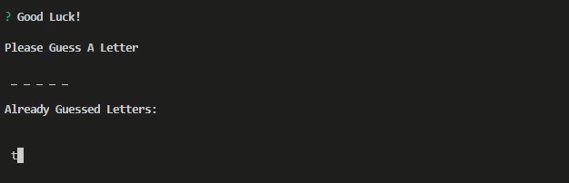

# constructor word guess
## Overview
This program is a console based version of hangman.

### Purpose 
The purpose of this program was to get use to using constructs across multiple node.js files. 

### Flow of Application
index.js contains the logic for the program and passes the random wort selected by the program to the word.js.  The word.js then breaks down the random word into its compent letters. word.js then passes the the letters to letter.js to test to see if the user guess is correct and returning the letter or a place holder.  